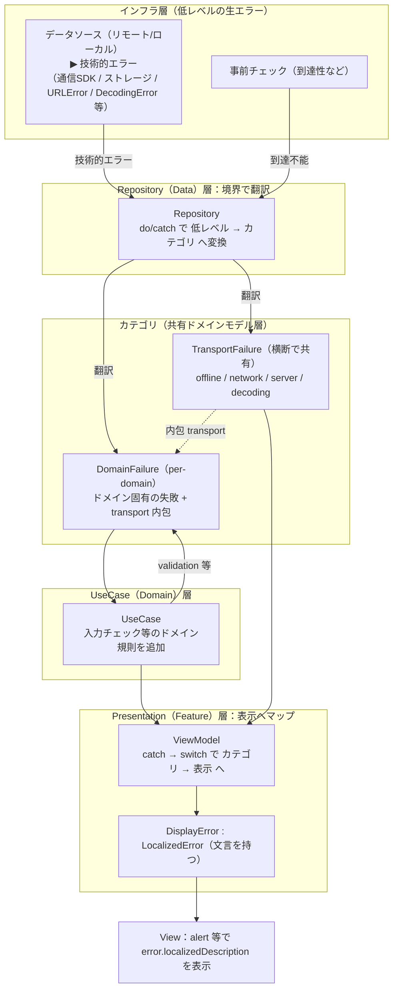

# エラーハンドリング設計指針

レイヤードなアプリ（ObjC/Swift 混在・マルチモジュール SPM・Swift 6・iOS 16+ を想定）で、
エラーを **層ごとに自分の言葉で持ち、境界で翻訳する** ための一般的な指針。

芯となる考え方: エラーを **3 段**に分け、各段を対応する層が所有する。
低レベルの生エラー → Repository で **ドメインのカテゴリ**へ翻訳 → Presentation で
**表示用の `LocalizedError`** へマップ → View は文言を出すだけ。

## 伝達フロー

## 3 段のエラー型

| 段 | 型（役割名） | 所有する層 | 役割 |
|---|---|---|---|
| **低レベル** | `〈Source〉Error` ＋ システム例外（`URLError` / `DecodingError` 等） | インフラ（データソース） | 生の技術的事実。上位（ドメインモデル）を**知らない**まま自分の言葉で投げる |
| **カテゴリ** | `〈Domain〉Failure`（per-domain）＋ 共有 `TransportFailure` | 共有ドメインモデル | 「**どこで/どの種別で失敗したか**」を表す。Repository が翻訳、UseCase が規則を追加 |
| **表示** | `〈Feature〉Error : LocalizedError` | Presentation（Feature） | 「**何を見せるか**」。文言（ローカライズ）を持つ |

## 設計原則

1. **境界で翻訳する**（値の DTO→Model 変換と同じ発想）。低レベルの生エラーは Repository 層で
   受け、ドメインのカテゴリへ変換する。低レベル層は上位型を参照しない（依存の向きを守る）。
2. **カテゴリ型は“全員が見える共有の葉”に置く**。カテゴリは「Repository が投げ・UseCase が投げ・
   各 Presentation が受ける」層またぎの契約。**追加依存なしで全層から参照できる最下層（共有モデル）**に
   置く。上位の実装層（Data 等）に置くと、それに依存しない一部の Presentation に不要な依存を強いる。
   下位すぎる層（Domain）だと Repository→Domain の循環になり置けない。
3. **per-domain カテゴリ**。単一の巨大 `AppError` に潰さない。ドメイン固有の失敗はドメインごとの
   enum にすると、`switch` の網羅性と独立進化（case 追加が他ドメインに波及しない）が得られる。
4. **横断的な失敗は共有型に括る**。通信のように**どのドメインでも同じ意味**の失敗は共有
   `TransportFailure` にまとめる。ドメイン固有の失敗も持つ型だけが `case transport(...)` で内包し、
   **横断的失敗しか無いドメインは共有型を直接使う**（意味のない単一 case ラッパを作らない）。
5. **表示（文言・UI 分岐）は Presentation に閉じる**。ドメインモデル/ロジック層はローカライズ文言を
   持たない。ViewModel がカテゴリ → 表示 `LocalizedError` にマップし、View は
   `error.localizedDescription` を出すだけ。文言だけでなく「再試行ボタンの有無」等の UI 分岐も
   ここで行う。
6. **未知値の受け皿を必ず持つ**。カテゴリにも表示にも `unknown` 等の既定を用意し、想定外でも
   クラッシュ・無反応にしない。

## 投げ方（伝達手段）の選択

| 方式 | 向き | 備考 |
|---|---|---|
| `throws` ＋ カテゴリ enum（推奨） | async/await と最も自然。上記フローの前提 | 境界は untyped throws で `catch as` |
| Swift 6 **typed throws**（`throws(F)`） | ViewModel の `switch` 漏れを**コンパイル時**に検出したい要所 | protocol 抽象がエラー型に固定される |
| `Result<Success, Failure>` | 同期的・関数合成主体のコード | async 時代は冗長になりがち |
| 単一 `AppError` | 極小規模 | ドメイン区別・網羅性を失う（原則非推奨） |
| `LocalizedError` を全層で | 変換層を省きたい小規模 | UI/文言が下層へ漏れ層が崩れる |

## テスト方針

- **翻訳は Repository テストで検証**（データソースのスタブに throw させ、カテゴリを assert）。
  例: `#expect(throws: TransportFailure.server(status: 503))`。
- **ドメイン規則（validation 等）は UseCase テスト**で。
- **private なマッピングは公開 API 経由で間接検証**。単体で試したくなったら internal 化して切り出す。

## 判断早見表

- 生の技術例外を UI/UseCase に散らさない → **Repository で一度だけカテゴリへ翻訳**。
- 失敗が **ドメイン固有**（入力・業務ルール） → per-domain `〈Domain〉Failure`。
- 失敗が **横断的**（通信・I/O） → 共有 `TransportFailure`（必要なドメインが内包）。
- 見せ方（文言・UI 分岐）を変えたい → **Presentation の `〈Feature〉Error`** で `switch`。
