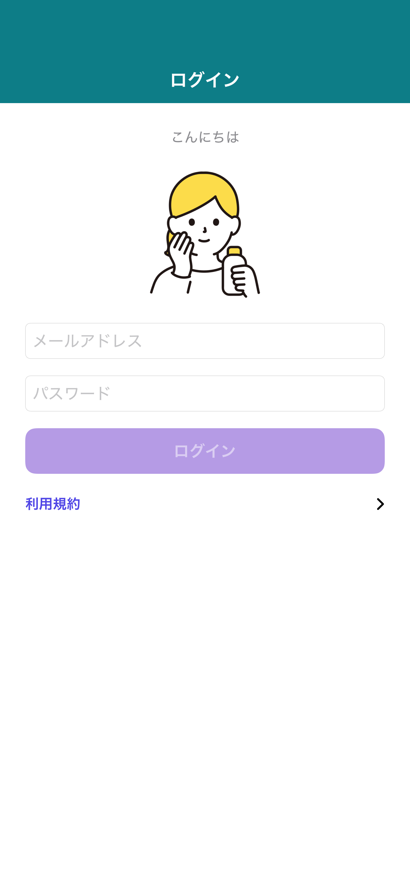

# スナップショットテスト運用メモ

主要画面の見た目を基準画像（PNG）で固定し、レイアウト/テーマの回帰を検知するための
**このプロジェクト固有の運用手順**。設計指針ではなく実行手順書。

> `project.yml`（XcodeGen）を使わない、他の（古い）プロジェクトへ導入する場合は
> [SNAPSHOT_TESTING_WITHOUT_PROJECT_YML.md](SNAPSHOT_TESTING_WITHOUT_PROJECT_YML.md) を参照。

> **どこから読むか**: 初めて触るなら「構成」→「導入手順」の順で読む。
> 既に導入済みで、日々テストを回す/基準を更新するだけなら「実行手順」から読めばよい。

## 構成

- ライブラリ: [pointfreeco/swift-snapshot-testing](https://github.com/pointfreeco/swift-snapshot-testing)
- テスト: `Tests/Snapshot/ScreenSnapshotTests.swift`（アプリ test バンドル `iOS-POC-2Tests` に同居）
- 基準画像: `Tests/Snapshot/__Snapshots__/ScreenSnapshotTests/*.png`（**Git 管理**）
- 撮影対象（3 つのアクセス方法）:
  - **SwiftUI・公開 Factory**: `LoginScreenFactory` / `MusicScreenFactory` が返す `UIViewController`
  - **SwiftUI・内部 View**: `@testable import ConfirmImpl` で `Confirm1View` / `Confirm2View` を直接生成
  - **ObjC/UIKit**: テスト用ブリッジヘッダ経由で `TodoInputViewController` を生成
- 現状のカバレッジ（各 light/dark）: Login（既定 / セッション復元）, Music（一覧 / 空）,
  Confirm1, Confirm2, Todo 入力（空）
- 決定論: 固定 `ViewImageConfig(.iPhone13)` ＋ `perceptualPrecision 0.98`。各画面の `#Preview` と
  同じ要領で Factory にスタブ UseCase を register してオフライン化。onAppear 駆動の状態は
  ウィンドウに載せて非同期を待ってから撮る（`hostAndSettle`）

### 基準画像の例

テストが実際に何を撮っているかの例（コミット済みの基準 PNG をそのまま表示。クリックで原寸）。

<table>
<tr>
<th>Login（既定）</th>
<th>Music（空）</th>
<th>Todo（空・ObjC/UIKit）</th>
</tr>
<tr>
<td><a href="../Tests/Snapshot/__Snapshots__/ScreenSnapshotTests/loginScreen.light.png"></a></td>
<td><a href="../Tests/Snapshot/__Snapshots__/ScreenSnapshotTests/musicListScreenEmpty.light.png"></a></td>
<td><a href="../Tests/Snapshot/__Snapshots__/ScreenSnapshotTests/todoInputScreenEmpty.light.png"></a></td>
</tr>
</table>

上の3枚は例。実際にはこのフォルダ（`Tests/Snapshot/__Snapshots__/ScreenSnapshotTests/`）に
撮影対象ごとの light/dark 2枚ずつが入っている。逆に言えば、**このフォルダに PNG が無い画面は
まだスナップショット未対応**ということ。

## 導入手順（ゼロから）

このプロジェクトに実際に導入したときの順序。既存の `iOS-POC-2Tests`（アプリ test バンドル）に
同居させることで、**新しいスキームや CI ジョブを増やさず**既存の `test:app` で回している。

### 1. ライブラリ依存を追加（`project.yml`）

`packages:` に追加：

```yaml
SnapshotTesting:
  url: https://github.com/pointfreeco/swift-snapshot-testing
  from: 1.17.0
```

`iOS-POC-2Tests` の `dependencies:` に、撮影に必要な分を追加：
`SnapshotTesting` 本体、対象画面の Feature モジュール（`LoginImpl` / `MusicImpl` / `ConfirmImpl` /
`ConfirmApi`）、スタブ登録用の `Domain` / `Model` / `Datastore` / `FactoryKit`。

### 2. 事前に必要なビルド設定（`project.yml`）

- **明示モジュール（Explicit Modules）を無効にする**：`settings.base` に
  `SWIFT_ENABLE_EXPLICIT_MODULES: NO` を追加する。

  「明示モジュール」は Xcode 16 以降の既定のビルド方式で、依存モジュールを1つずつ
  事前ビルド（プリコンパイル）してから使う。この方式のまま SnapshotTesting を組み込むと、
  テストのビルド時に **`module 'os_object' is needed but has not been provided` という
  エラーで失敗する**（SnapshotTesting のコード自体が悪いのではなく、依存先をたどった先で
  WebKit フレームワークの事前ビルドに失敗する、Xcode 16 の明示モジュール機能側の不具合）。
  `NO` にすると、事前ビルドをしない従来方式のビルドに戻り、この失敗を回避できる。
- **基準 PNG をビルド入力（テストバンドルのリソース）から外す**：`iOS-POC-2Tests.sources` に
  `excludes` を追加する。
  ```yaml
  sources:
    - path: Tests
      excludes:
        - "Snapshot/__Snapshots__/**"
  ```
  これが無いと、XcodeGen が `Tests/` 配下を丸ごとスキャンして PNG までテストバンドルの
  リソースとして取り込んでしまう。その状態で基準 PNG を消す（記録し直すために）と、
  `.xcodeproj` 側にはまだ「このファイルをバンドルに入れる」という参照が残っているため
  `Build input file cannot be found` でビルドが失敗する。
- **自作モジュールに、Apple のシステムフレームワークと同じ名前を付けない**：本プロジェクトでは
  データ層のモジュールに `Network` という名前を付けていたが、これは Apple の
  `Network.framework` と同名だった。SnapshotTesting の依存グラフをたどると
  AVFoundation・WebKit 経由でこの `Network.framework` を参照する箇所があり、そこで
  「どちらの `Network` を指しているか」が衝突してビルドが壊れる。回避策は**衝突しない名前へ
  リネームする**こと（本プロジェクトは `Networking` に変更した）。

### 3. テストを書く（`Tests/Snapshot/ScreenSnapshotTests.swift`）

Swift Testing（`import Testing`）で `assertSnapshot` を呼ぶ。共通方針：
固定 `config`（`.iPhone13`）＋ `perceptualPrecision 0.98`、light/dark を `named:` で 2 枚、
`Container.shared` にスタブ UseCase を register してオフライン・固定内容にする。

対象の作り方は 3 パターン：

- **SwiftUI・公開 Factory**（例: Login/Music）: `LoginScreenFactory.makeLoginScreen()` を撮る。
  内部 View 非公開でも公開窓口経由なので `@testable` 不要。
- **SwiftUI・内部 View**（例: Confirm1/2）: `@testable import <Impl>` で内部 `View` を直接生成。
  `init(text:router:…)` があるので状態を注入でき、Router は no-op スタブを渡す。
- **ObjC/UIKit**（例: Todo）: **テスト用ブリッジヘッダ**を用意し `project.yml` に設定：
  ```yaml
  SWIFT_OBJC_BRIDGING_HEADER: Tests/iOS-POC-2Tests-Bridging-Header.h
  HEADER_SEARCH_PATHS:
    - "$(SRCROOT)/iOS-POC-2/Controllers"
  ```
  ブリッジヘッダに `#import "TodoInputViewController.h"` を書けば Swift テストから生成できる。

決定論のコツ：

- **onAppear で非同期ロードする画面**（Music/Todo/Login のセッション復元）は、VC を実ウィンドウに
  載せて `viewWillAppear`/`onAppear` を発火させ、ロード完了まで待ってから撮る（ヘルパ `hostAndSettle`）。
- **`AsyncImage`** はリモート取得で不安定になるので、スタブのデータで URL を `nil` にしてプレースホルダ固定。
- **スピナー（`ProgressView`）やエラー `alert` は撮らない**。
  スピナーはアニメーションが回転し続けるため、撮るたびに絵が変わり基準と一致しない。
  `alert` は SwiftUI が別ウィンドウ相当のレイヤーに重ねて表示する仕組みで、撮影対象の
  `UIHostingController`（元の画面）をそのまま画像化しても alert 自体は写り込まない
  （＝alert だけ撮っても意味のある画像にならない）。

### 4. プロジェクト再生成 → 基準記録

`xcodegen generate` は XcodeGen という別ツールのコマンドで、Xcode の GUI に相当する操作は無い
（`project.yml` を Xcode プロジェクトへ変換する処理そのものなので、必ずターミナルで実行する）。

```
xcodegen generate
```

その後は下記「実行手順」の記録フロー（初回は自動記録で fail → 目視 → 再実行でパス確定）で
基準 PNG を作り、コミットする。

### 5. CI 連携

追加ジョブは不要（`.gitlab-ci.yml` の `test:app` がそのまま実行する）。
**`SIMULATOR_NAME` を、基準画像を記録した端末/OS に合わせる**ことだけ必須（現状 `iPhone 17`）。

## 実行手順

コマンドを打つより Xcode の GUI で操作した方が楽な作業が多いので、**Xcode での操作を基本手順
とし、CLI（ターミナル）はその等価コマンドとして併記する**。CI や自動化で使うのは CLI 側。

共通の注意点: **実行に使うシミュレータ端末は、基準画像を記録した端末/OS に揃える**
（`.gitlab-ci.yml` の `SIMULATOR_NAME`。現状 `iPhone 17`）。ズレると、レイアウトは同じでも
**OS のレンダリング差**（フォント・アンチエイリアス等）で不一致になることがある
（微小差は `perceptualPrecision` で吸収するが、端末/OS を変えたら基準ごと再記録するのが安全）。

### 1. 実行（既存の基準と照合）

**Xcode**: 実行先デバイス（ウィンドウ上部のスキーム/デバイス選択）を `iPhone 17` にする →
テストナビゲータ（左サイドバー、フラスコのアイコン。ショートカット **⌘6**）を開く →
`iOS-POC-2Tests` の中の `ScreenSnapshotTests` を探し、行にカーソルを合わせると出る
**◇ をクリック**（スイート全体を実行）。プロジェクト全体のテストでよければ **⌘U**。

**CLI（同じことをターミナルで）**:

```
xcodebuild test -project iOS-POC-2.xcodeproj -scheme iOS-POC-2 \
  -destination 'platform=iOS Simulator,name=iPhone 17' \
  -only-testing:iOS-POC-2Tests/ScreenSnapshotTests CODE_SIGNING_ALLOWED=NO
```

- `-only-testing` は**スイート単位**（`.../ScreenSnapshotTests`）で指定する。
  Swift Testing のため、関数名までの指定（`.../ScreenSnapshotTests/loginScreen`）は
  マッチせず「0 tests」になる。

### 2. 初回・新規画面の基準記録

GUI・CLI どちらで実行しても、基準 PNG が無い状態で実行すると**自動で記録して “fail” 扱い**に
なる（`No reference was found on disk. Automatically recorded snapshot`）。
記録された PNG を目視確認 → もう一度「1. 実行」を行ってパスすれば確定。

### 3. 意図した UI 変更で基準を貼り替える

見た目を意図的に変えたら基準を更新する。以下のいずれかで再記録 → 目視 → コミット。

**方法A（対象の基準だけ消す）** — 一部の画面だけ更新したいとき向き。

- **Finder**: `Tests/Snapshot/__Snapshots__/ScreenSnapshotTests/` を開き、対象の PNG
  （light/dark）をゴミ箱へ。
- そのあと「1. 実行」と同じ操作（Xcode なら ◇ クリックまたは ⌘U）をすれば、消した分だけ
  自動で再記録される。
- CLI でファイルを消すなら：
  ```
  rm Tests/Snapshot/__Snapshots__/ScreenSnapshotTests/musicListScreen.*.png
  ```

**方法B（環境変数で強制的に全再記録）** — 触れたテストの基準を**まとめて**撮り直したいとき向き
（ファイルが既にあっても上書きされる）。

- **Xcode**: メニュー **Product ▸ Scheme ▸ Edit Scheme…**（**⌘<**）→ 左のリストで **Test** を
  選択 → **Arguments** タブ → 下段 **Environment Variables** の **+** で行を追加し、
  Name に `SNAPSHOT_TESTING_RECORD`、Value に `all` を入力してチェックを **ON** → **Close**。
  この状態で対象テストを実行すると全て再記録される。**記録が終わったら、同じ画面で
  チェックを OFF に戻すこと**（つけたままだと以後ずっと「比較」ではなく「記録」動作になり、
  UI が壊れても気づけなくなる）。
- **CLI**:
  ```
  SNAPSHOT_TESTING_RECORD=all xcodebuild test -project iOS-POC-2.xcodeproj -scheme iOS-POC-2 \
    -destination 'platform=iOS Simulator,name=iPhone 17' \
    -only-testing:iOS-POC-2Tests/ScreenSnapshotTests CODE_SIGNING_ALLOWED=NO
  ```
  （CLI は実行のたびに指定するだけなので、Xcode のように戻し忘れる心配が無い）

## 結果の確認方法

### 合否

**Xcode**: テストナビゲータの各行に付く緑チェック/赤バツ、または実行後に自動で開く
**Report ナビゲータ**（左サイドバー、**⌘9**）のサマリー（パス数/フェイル数）。

**CLI（ターミナル出力）**: 全部パスすると、各テストの `✔` と末尾の `** TEST SUCCEEDED **` が出る：

```
✔ Test "Login screen — default (light / dark)" passed after 0.141 seconds.
✔ Test "Music list — populated (light / dark)" passed after 0.997 seconds.
✔ Suite ScreenSnapshotTests passed after 2.167 seconds.
** TEST SUCCEEDED **
```

不一致があると `✘` と `does not match reference.`、末尾は `** TEST FAILED **` になる：

```
✘ Test "Login screen — default (light / dark)" recorded an issue at ScreenSnapshotTests.swift:36:23: Issue recorded
↳ Snapshot "light" does not match reference.
  The percentage of pixels that match 0.9983034 is less than required 1.0
✘ Test "Login screen — default (light / dark)" failed after 1.165 seconds with 2 issues.
** TEST FAILED **
```

### 差分の中身を見る

失敗時、参照（reference）・実測（failure）・差分（difference）の PNG が生成される。

**Xcode**（実際にこの手順で差分を確認できることを確認済み）:

1. **Report ナビゲータ**（**⌘9**）を開き、直近のテスト実行を選ぶ。
2. 「Test Failures」に並ぶ失敗テスト（例: `Login screen — default (light / dark)`）を
   **ダブルクリック**。
3. 開いた詳細画面の左側「Activities」リストに `Added attachment name reference.png` /
   `failure.png` / `difference.png` が並ぶので、それぞれクリックすると右側に画像が
   プレビューされる。`difference.png` を選ぶと、基準とのズレが分かる差分画像が見られる。

**CLI**（スクリプトでまとめて取り出したいとき向き）: `-resultBundlePath` を付けて実行し、
`.xcresult` から書き出す。

```
xcodebuild test -project iOS-POC-2.xcodeproj -scheme iOS-POC-2 \
  -destination 'platform=iOS Simulator,name=iPhone 17' \
  -only-testing:iOS-POC-2Tests/ScreenSnapshotTests CODE_SIGNING_ALLOWED=NO \
  -resultBundlePath /tmp/snap.xcresult
```

```
xcrun xcresulttool export attachments --path /tmp/snap.xcresult --output-path /tmp/snap_attach
```

書き出し先の `manifest.json` に「テスト名 → 添付ファイル名」の対応が入っているので、
`difference_*.png` を探して開けば差分が見える。

### 基準画像そのもの

**Finder**（または Xcode のプロジェクトナビゲータ）で
`Tests/Snapshot/__Snapshots__/ScreenSnapshotTests/` の PNG を直接開く（「構成」の表の画像も同じもの）。

## つまずきどころ（このリポジトリ固有）

原因と対処は「導入手順 §2」で説明済み。ここでは**症状から逆引き**できるようにする。

| 症状（エラーメッセージ） | 原因 | 対処 |
|---|---|---|
| `project.yml` を変えたのに反映されない | `.xcodeproj` は生成物 | `xcodegen generate` を実行する |
| `module 'os_object' is needed but has not been provided` | 明示モジュールが有効（WebKit の事前ビルドに失敗） | 導入手順§2の `SWIFT_ENABLE_EXPLICIT_MODULES: NO` を確認 |
| `Build input file cannot be found`（PNG） | PNG がビルド入力に取り込まれている | 導入手順§2の `excludes` 設定を確認。それでも起きたら `xcodegen generate` |
| `Network.h` 系のビルド失敗 | 自作モジュール名がシステムフレームワークと衝突（例: `Network`） | 衝突しない名前にリネーム（本プロジェクトは `Networking`） |
| 上記の衝突/欠落エラーが**設定を直したのに**まだ出る | 古いビルド生成物が残っている | DerivedData をクリーンして再実行 |
| Keychain 系テストが `-34018` で失敗 | 署名なし（`CODE_SIGNING_ALLOWED=NO`）で entitlement 不足 | スナップショットとは別問題。署名を有効にして実行すれば通る |
